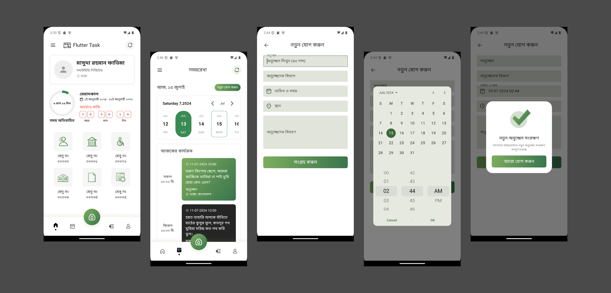

# softbd_assignment_app

Tried to follow the Figma design as much as possible in 24h.\
(Fixed some things on 14th July after 9am).

Applicant name: Masuda Rahman Fatima

### Screenshots:

Here is a screen recording of the app in a google drive folder:
[https://drive.google.com/drive/folders/15v3xz7X0JzTRRBhW2IJPuonXOWAvW5S1?usp=sharing](https://drive.google.com/drive/folders/15v3xz7X0JzTRRBhW2IJPuonXOWAvW5S1?usp=sharing)

### API link used: 
[https://api.npoint.io/bc69ae1f6991da81ab9a](https://api.npoint.io/bc69ae1f6991da81ab9a)

### Figma Design followed: 
[https://www.figma.com/proto/WZCzGuYoN9Es99LZgNbBbJ/Flutter-Assignment---2024?t=kcuHhBrjA0ZkmAwN-1](https://www.figma.com/proto/WZCzGuYoN9Es99LZgNbBbJ/Flutter-Assignment---2024?t=kcuHhBrjA0ZkmAwN-1)

